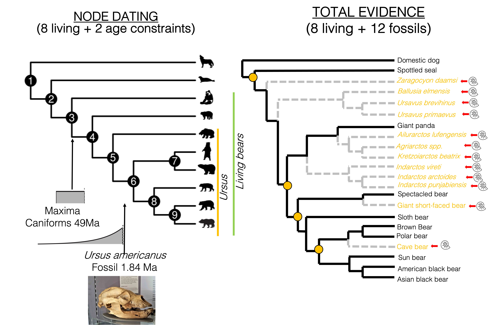
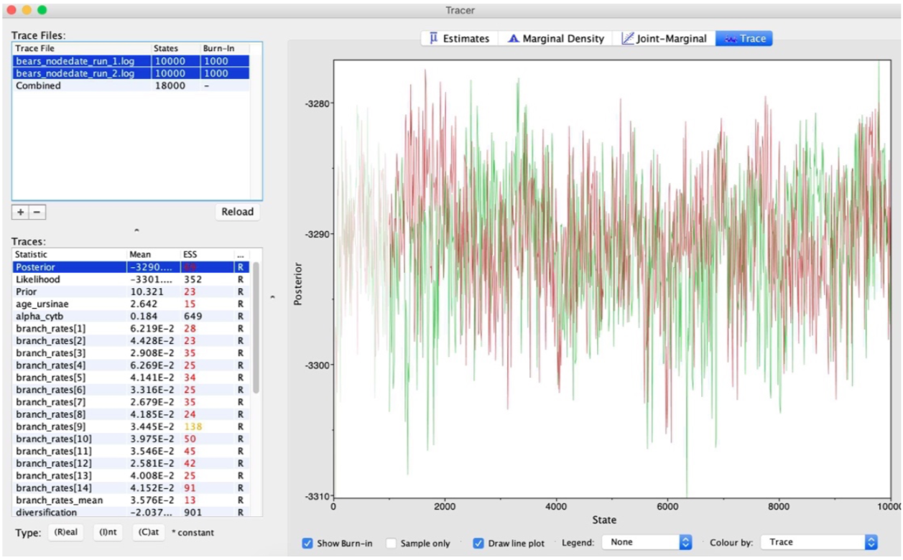
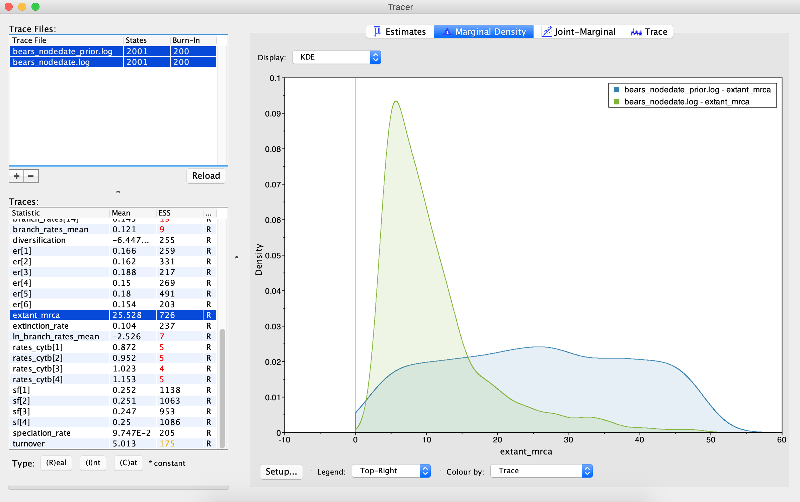
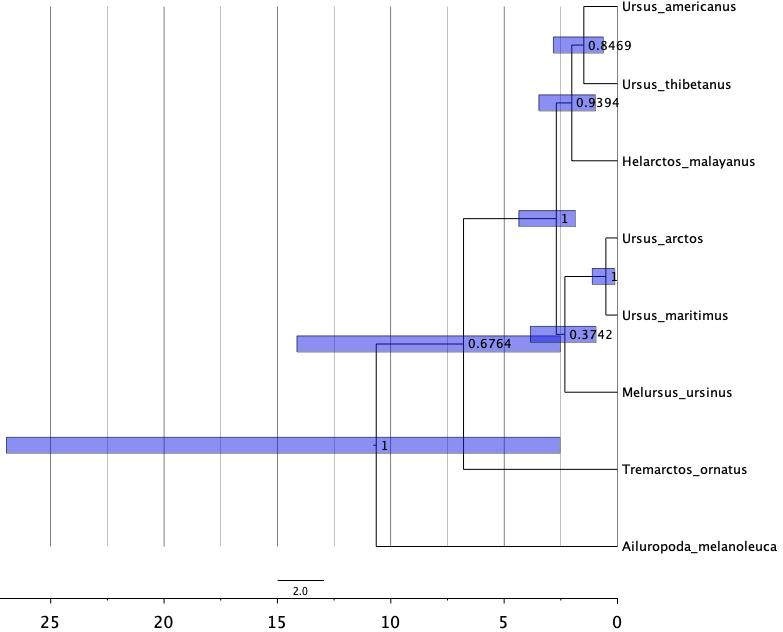

# Divergence Time Estimation based on Molecular clocks
# Tutorial in a nutshell


Instructors: **Jesus Lozano-Fernandez** & **Leandro Aristide**

We are going to run a divergence time estimation analysis using a **NODE DATING** approach and a **TOTAL EVIDENCE ANALYSIS** in the context of bear evolution; compare the results of both methodologies to infer the age of the Most Recent Common Ancestor (MRCA) of Ursinae, and assess the impact of using different methods, models and priors. For coherence with the Bayesian class, we are going to use [**RevBayes**](https://revbayes.github.io), which is a flexible software with his own programming language similar to R, named Rev. Is out of the scope of this short tutorial to be able to fully understand the language, the models or the parameters. At the end of the class, you are expected to have a grasp of the main difference between methods, the utility of fossil and stratigraphic calibrations and the relevance of the prior assumptions. This tutorial is based on material available for learning divergence time estimation using RevBayes, available at [https://revbayes.github.io/tutorials/dating/](https://revbayes.github.io/tutorials/dating/). All the commands and scripts to run the exercises and the datasets has been already built and are in place, so you won't need to modify them, just running the analyses. Moreover, the output of previous analyses have been uploaded, in case you face some difficulties. We will, though, examine the input files, run the analyes together, and learn about the interpretation of results.

 

***

## Software description

[**RevBayes**](https://revbayes.github.io) is a Bayesian phylogenetic inference software that uses probabilistic graphical models. RevBayes uses a scripting language to call functions and provide arguments: the `Rev` language. It is similar to `R` but more heavily scripted.

[**Tracer**](http://tree.bio.ed.ac.uk/software/tracer/) is a program for analysing the trace files generated by Bayesian MCMC runs (that is, the continuous parameter values sampled from the chain)

[**FigTree**](http://tree.bio.ed.ac.uk/software/figtree/)) is a program to graphically view phylogenetic trees, including annotations

***

## Data description and access

The tutorial contains four folders. `NodeDating/` and `TotalEvidence/` folders contain the `data/` & `scripts/` subfolders to run the two exercises proposed. Within `Outuput_Exercises_Solved/`, you can find `output/` folders with the results of a Node Dating and Total Evidence analyses that were previously ran (in case you experience problems or want to double check your results). A fourth `img/` folder  contains the images embedded in the `/README.md` file.

***

# Exercise on NODE DATING

* Based on the 3rd exercise *‘Estimating speciation times using node dating’* of the [**RevBayes tutorials**](https://revbayes.github.io/tutorials/dating/nodedate)


## Background

In this exercise we will use information from the fossil record to calibrate the molecular substitution rate to absolute times using node dating techniques. This approach involves assigning probability densities that incorporate temporal information from the fossil record to particular nodes in the tree.

For running this exercise, we should be inside the `NodeDating/` folder, which just contains two folders: `data/` & `scripts/`.

In the **`data/`** folder, you will find the following files:
* `data/bears_cytb.nex` # *an alignment in NEXUS format of 1,000 bp of cytochrome b sequences for 8 bear species*
* `data/bears_taxa.tsv` # *a tab-separated table listing every bear species (both living and fossil) and their occurrence age ranges. For living taxa, the minimum age is 0.0 (i.e. the present).*

In the **`scripts/`** folder, you will find the following files:
* `scripts/sub_GTRG.Rev` # *Sequence substitution model GTR + Γ*
* `scripts/clock_relaxed_lognormal.Rev` # *Relaxed clock model Uncorrelated*
* `scripts/tree_BD.Rev` # *Birth Death tree prior (without calibrations)*
* `scripts/tree_BD_nodedate.Rev` # *Birth Death tree prior WITH calibrations*
* `scripts/MCMC_dating_ex3.Rev` # *Master Rev file (loads the data, the other scripts specifying models and monitors the output of the MCMC sampler)*
* `scripts/MCMC_dating_ex3_prior.Rev` # *Master Rev file under the priors (not data)*

### Justification for Models and Priors

*Calibrations*

The file `/bears_taxa.tsv` contains information about the stratigraphic ranges for 20 bear species, including 12 extinct species. We’re not going to use all of the information from this file in this exercise, because the node dating approach to calibration limits the amount of data we can take advantage of, but we’ll use some of this information to constrain the age of two nodes We’re going to add two node calibrations: one on **the root** and one on the **internal node** for the clade Ursinae.
* The oldest first appearance of a crown group bear in our dataset is Ursus americanus at 1.84 million of years ago (Ma).
* We will take advantage of a previous estimate (∼49 Ma) for the age of caniforms, which is the clade containing bears and other “dog-like” mammals, from [dos Reis et al. 2012](https://royalsocietypublishing.org/doi/abs/10.1098/rspb.2012.0683). We will assume that the age of crown bears cannot be older than this.

*The clock model*

Remember the clock (or branch-rate) model describes how rates of substitution vary (or not) across the tree. We are going to use the uncorrelated lognormal relaxed clock model. In this model rates for each branch will be drawn independently from a lognormal distribution. `/clock_relaxed_lognormal.Rev`

*The tree prior*

Since all of the taxa included in the analysis in this exercise are living species we’ll use a birth-death model that doesn’t incorporate the fossil recovery process, however, we will add calibration information from the fossil record to generate timetrees on a non- arbitrary timescale. `/tree_BD_nodedate.Rev`

*The master Rev script*

We are also interested in the age of the most-recent-common ancestor (MRCA) of all living bears. To monitor the age of this node in our MCMC sample, we must use the clade function to identify the node.The analysis is set to run two chains for **10,000 generations** (10 to 30 minutes, really short analysis). `/MCMC_dating_ex3.Rev`

## Starting the analysis

### 1- On the terminal, start RevBayes by typing ```rb```
RevBayes will open, then you will upload the master Rev script were all the needed information to perform the whole analysis is in there. Type the following and the analysis will automatically start:

```
source("scripts/MCMC_dating_ex3.Rev")
```

### 2- By the time you are waiting for the results of this analyses, start a second analysis under the prior.
It is always useful to examine the output of your MCMC analysis in the absence of information from the sequence data (i.e. without calculating the likelihood that comes from the substitution model). Type on the terminal ```rb```

```
source("scripts/MCMC_dating_ex3_prior.Rev")
```

When both analyses are finished, let’s check at the newly generated **`ouput/`** folder, which will contain:
* `/bears_nodedate.log` # *log files to upload on Tracer of the posterior sample*
* `/bears_nodedate_run_1.log` # *log data generated by chain 1*
* `/bears_nodedate_run_1.trees` # *trees generated by chain 1*
* `/bears_nodedate_run_2.log` # *log data generated by chain 2*
* `/bears_nodedate_run_2.trees` # *trees generated by chain 2*
* `/bears_nodedate.mcc.tre` # *Maximum Clade Credibility tree*
* `/bears_nodedate.trees` # *sampled trees*
* `/bears_nodedate_prior.log` # *log files to upload on Tracer of the posteriors under prior (no data)*
* `/bears_nodedate_prior_run_1.log` # *log data generated by chain 1 (prior, no data)*
* `/bears_nodedate_prior_run_1.trees` # *trees generated by chain 1 (prior, no data)*
* `/bears_nodedate_prior_run_2.log` # *log data generated by chain 2 (prior, no data)*
* `/bears_nodedate_prior_run_2.trees` # *trees generated by chain 2 (prior, no data)*
* `/bears_nodedate_prior.mcc.tre` # *Maximum Clade Credibility tree under prior*
* `/bears_nodedate_prior.trees` # *sampled trees under the prior*


### 3- Analysing results with [**Tracer**](http://tree.bio.ed.ac.uk/software/tracer/)
Evaluate and Summarize Your Results
In this section, we will evaluate the *mixing* and *convergence* of our MCMC simulation using the program **Tracer**.

 

Immediately upon loading your log files, you will see the list of *Trace Files* on the left-hand side (you can load multiple files). The bottom left section, called *Traces*, provides a list of every parameter in the log file, along with the mean and the effective sample size (ESS) for the posterior sample of that parameter. The ESS statistic provides a measure of the number of independent draws in our sample for a given parameter. This quantity will typically be much smaller than the number of generations of the chain. In **Tracer**, poor to fair values for the ESS will be coloured red and yellow. You will likely see a lot of red and yellow numbers because the MCMC runs in this exercise are too short to effectively sample the posterior distributions of most parameters. A much longer analysis is provided in the output directory.

Look through the various parameters and statistics in the list of *Traces*.
 
>**Are there any parameters that have really low ESS? Why do you think that might be?**</br>

 

Next, we can click over to the *Trace* window. This window shows us the samples for a given parameter at each iteration of the MCMC. The left side of the chain has a shaded portion that has been excluded as “burn-in”. Samples taken near the beginning of chain are often discarded or “burned” because the MCMC may not immediately begin sampling from the target posterior distribution, particularly if the starting condition of the chain is far from the region of highest posterior density. The presence of a trend or large leaps in a parameter value might indicate that your MCMC is not mixing well.

Go to the *extant_mrca* parameter in the *Traces* left column, and then check the different values on the *Estimates* window on the right.

>**What is the mean and 95% highest posterior density of the age of the MRCA for all living bears? And of Ursinae?**</br>
-  

Compare the values of the age of the *extant_mrca* of the analysis only under the priors (with no data),  `/bears_nodate_prior.log` against the ones including data `/bears_nodedate.log`.

>**Are the prior densities driving the posteriors (ie are we over-constraining)?**</br>

### 4- Using [**FigTree**](http://tree.bio.ed.ac.uk/software/figtree/) to visualize the topology and ages 

* In the newly generated folder `output/`, open using *FigTree* the file ended with *.mcc.tre (Maximum Clade Credibitilty tree, that summarises in a single tree the results of MCMC analysis).
* Press Ok when you are asked to include the node/branches and let the name *label*. Click on *Node Labels* and then Display the *Posterior* probability, which will be a measure of support of each node.
* Click on Node Bars and Display the *age_95%_HPD*, so you’ll be able to be the 95% Highest Posterior Density interval over the nodes. You can play with the bar width and the Font size to make the figure to look clearer.
* Lastly, add an *Scale Axis* and select a *Reverse axis*, so the present time will be on the right and the past time will be on the left.

-  

>**Which is the Posterior Probability of the node leading to Ursinae and does agree the 95% HPD seeing here with the one in Tracer?**</br>

***

# Exercise on TOTAL EVIDENCE
* *Based on the 5th exercise ‘Estimating speciation times using total-evidence dating’*

https://revbayes.github.io/tutorials/dating/tefbd

https://revbayes.github.io/tutorials/fbd/#Intro-FBD [an extended analysis]

## Background

In this exercise, we will combine different types of data from 18 species of extant and extinct bears to estimate a posterior distribution of calibrated time trees for this group. We have molecular sequence data for eight species, which represent all of the eight living bears. There is also available molecular sequence data for two recently extincted species, the sub-fossil specimens (*Arctodus simus*, *Ursus spelaeus*), but we haven’t included them for simplicity.

The sequence alignment is the same as the we used one before and the morphological character matrix unites 18 taxa (both fossil and extant) with 62 binary (states 0 or 1) characters from [Abella et al. 2012](https://journals.plos.org/plosone/article?id=10.1371/journal.pone.0048985). For the fossil species, occurrence times are obtained from the literature or fossil databases. The fossil species used in this analysis are listed in ‘bears_taxa.tsv’ along with the age range for the species and relevant citation.

For running this exercise, we should be inside the `TotalEvidence/` folder, which just contains two folders: `data/` & `scripts/`. Within **`data/`** folder, you will find the following files:
* `data/bears_cytb.nex` # *an alignment in NEXUS format of 1,000 bp of cytochrome b sequences for 8 living bear species*
* `data/bears_taxa.tsv` # *a tab-separated table listing every bear species (both fossil and extant) and their occurrence age ranges. For extant taxa, the minimum age is 0.0 (i.e. the present).*
* * `data/bears_morphology.nex` # *a nexus file with scored morphology of living and fossils (not all data has been scored).*

In the **`scripts/`** folder, you will find the following files:
* `scripts/sub_GTRG.Rev` # *Nucleotide sequence substitution model GTR + Γ*
* `scripts/sub_Mk.Rev` # *Morphology character change model Mk*
* `scripts/clock_relaxed_lognormal.Rev` # *Relaxed clock model Uncorrelated*
* `scripts/clock_morpho.Rev` # *Morphology rate clock under global model*
* `scripts/tree_TEFBD.Rev` # *Fossilized Birth Death tree prior model*
* `scripts/MCMC_dating_ex5.Rev` # *Master Rev file (loads the data, the other scripts specifying models and monitors the output of the MCMC sampler)*

## Starting the analysis

### 5- On the terminal, start RevBayes by typing ```rb```

RevBayes will open, then you will upload the master Rev script, that it contains all the information to perform the entire anaylsis. Type the following:
```
source("scripts/MCMC_dating_ex5.Rev")
```
### 6- Analysing results with [**Tracer**](http://tree.bio.ed.ac.uk/software/tracer/)
Once the output file has been generated, open the `/bears_TEFBD.log` file using **Tracer**. Go to the *age_extant* parameter in the *Estimates* window.

>**What is the mean and 95% highest posterior density of the age of the MRCA of Ursinae? Are these estimates more precise than in the Node dating analysis?**</br>

### 7- Using [**FigTree**](http://tree.bio.ed.ac.uk/software/figtree/) to visualize the topology and ages.

Proceed as you have done before for the Node Calibrated analysis.


This analysis had run for 30,000 generations, a shorter analysis will probably look different. 

>**How do fossil taxa relate with the living one?**</br>
>**Which fossils belong to the MRCA of all living bears, and to Ursinae?**</br>
>**Find major differences between ages and relationships of node calibrated and Total Evidence analysis**</br>

When there are sampled ancestors present in the tree, visualizing the tree can be fairly difficult in traditional tree viewers. We will make use of a browser-based tree viewer called **[IcyTree](https://icytree.org)**, created by Tim Vaughan. IcyTree has many unique options for visualizing phylogenetic trees and can produce publication-quality vector image files (i.e. SVG). Additionally, it correctly represents sampled ancestors on the tree as nodes, each with only one descendant.
